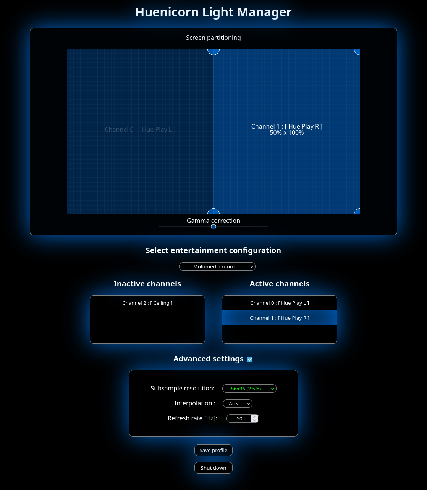

# Huenicorn

A free Philips Hue™ screen synchronizer for Gnu/Linux

## Description

Huenicorn is a free ambilight driver for Gnu/Linux.
In other words, Huenicorn allows you to extend the colorful atmosphere of your computer screen to your Hue light bulbs in real-time.
Huenicorn provides a simple web interface to assign specific portions of screen to the light bulbs you desire and save the settings for further entertainment sessions.

### Screenshot

|  |
|:--:|
| *Caption: Huenicorn Light Manager user interface* |

## Project status

Huenicorn 1.0.4 is available.

This revision brings

* Wayland support
* Automatic grabber selection for X.org / Wayland sessions

## Getting Started

* Before using Huenicorn, you need to define some entertainment area on your Hue bridge through the official application provided by Philips.

### Requirements

* Gnu/Linux system running with graphics sessions based on X.org or Wayland
* Philips Hue bridge with registered lamps

### Dependencies

* [X.Org](https://xorg.freedesktop.org) or [Wayland](https://wayland.freedesktop.org)
* [OpenCV](https://github.com/opencv/opencv)
* [Restbed](https://github.com/Corvusoft/restbed)
* [Mbed-TLS](https://github.com/Mbed-TLS/mbedtls)
* [GLM](https://github.com/g-truc/glm)
* [nlohmann-json](https://github.com/nlohmann/json)
* [CurlPP](https://github.com/jpbarrette/curlpp)


#### Dependencies intallation
<details>

<summary>ArchLinux</summary>

```bash
  # In the unlikely case you don't have one of them already:
  sudo pacman -S xorg-server
  # And/or
  sudo pacman -S wayland glib2 pipewire

  # Mandatory
  sudo pacman -S opencv mbedtls glm nlohmann-json
  # Some more dependencies from AUR
  yay -S restbed libcurlpp
```
</details>

<details>
<summary>OpenSUSE Tumbleweed</summary>
<br/>

These dependencies needed to be installed on OpenSUSE Tumbleweed 20231011 to build and run Huenicorn:  

```bash
sudo zypper install opencv-devel libopencv408 python311-jsonschema glm-devel nlohmann_json-devel
```

Additionally you have to build the curlpp, Restbed and Mbed-TLS from source from the links above.   
Follow the build instructions in their respective README files and copy them to the appropriate place, as some of them don't do that automatically (usually /usr/local/lib64/ for libraries (check LD_LIBRARY_PATH) or /usr/local/include/ for includes)

</details>

<details>
<summary>Ubuntu >= 22.04</summary>

```bash
# Add this repository for mbedtls, opencv
sudo add-apt-repository universe
sudo apt-get update

# For X.Org support:
sudo apt-get install libx11-dev libxext-dev

# For Wayland support:
sudo apt-get install libglib2.0-dev libpipewire-0.3-dev 


# Mandatory libraries
sudo apt-get install build-essential libopencv-dev libglm-dev libcurl4-openssl-dev nlohmann-json3-dev libmbedtls-dev

# Restbed has to be compiled from the source repository because the package version is outdated:

git clone --recursive https://github.com/corvusoft/restbed.git
cd restbed
mkdir build && cd build
cmake -DBUILD_SSL=OFF -DBUILD_TESTS=OFF ..
sudo make install
sudo cp ../distribution/library/librestbed.* /usr/lib
sudo cp -r ../distribution/include/* /usr/include
```

Earlier versions of Ubuntu are not officially supported. Please refer to [This post](https://gitlab.com/openjowelsofts/huenicorn/-/issues/5#note_1700387996) if you still want to give it a try.

</details>

### Building Huenicorn

```bash
git clone https://gitlab.com/openjowelsofts/huenicorn.git
cd huenicorn
mkdir build && cd build
cmake ..
make
```

The output is a standalone executable called "huenicorn".
When running Huenicorn, make sure that the ```webroot``` directory is in the cwd (current working directory).

### Executing program

* Run the executable named "huenicorn" in the way you prefer (Terminal if you want some text feedback)
* Open your favorite web browser at [127.0.0.1:8080](http://127.0.0.1:8080)
Browser will spawn automatically for the initial setup and as long as no light profile has been saved
(Service port can be edited in configuration. Default is 8080)

#### Initial setup

When executed for the first time, Huenicorn spawns the setup page in your favorite browser. It consists of a step-by-step wizard to locate your Hue bridge on the network and register an user on it.

Upon setup proper setup termination, Huenicorn will resume in its ordinary execution workflow.

The webpage can then be refreshed to reach the Light Manager interface.

#### Ordinary execution worflow

<details>
  <summary>Wayland-specific step</summary>
  <br/>

  At initialization, the grabber will ask you to select some source through a screen sharing portal. Pick the desired screen and validate by clicking "Share".
</details>
<br/>

Huenicorn will automatically select a the suitable screen-grabber for the graphic session.

At startup, Huenicorn will look for a saved profile and start its color streaming execution.

If you want to assign lights to some portions of your screen, open the web interface and drag'n'drop the available lights from the left list to the right one.

When a synced light is selected in the list, its portion of allocated screen can be adjusted in the screen partitioning section.

Once you are satisfied with the layout, you can save it as a profile and it will be automatically reloaded for further executions.

As long as no profile has been saved, light management interface will spawn automatically at startup.

### Configuration files

The configuration files can be found in your home directory at ~/.config/huenicorn/
config.json contains the bridge-related configuration.
profile.json contains the saved channels geometry for an entertainment configuration.

The data structure of these files is JSON.

#### config.json

  This file contains some parameters that can be manually edited after initial setup.

* **boundBackendIP**:  (String) IP address to bind the service on
* **bridgeAddress**:  (String) Address of the Philips Hue bridge
* **credentials**:
  * **clientkey**: (String) 32 hexadecimal characters key provided by initial setup
  * **username**: (String) Base64 or UUID username provided by initial setup
* **profile**:  (String) Name of the current user-defined light profile
* **refreshRate**:  (Unsigned) Screen capture and light update frequency
* **restServerPort**:  (Unsigned) Port on which the web UI must respond
* **subsampleWidth**:  (Unsigned) Width of the treated image subsample

#### profile.json

This file contains a list of channels related to an entertainment configuration.

* **Channels**: (Array) List of entertainment configuration channels
  * **active**: (Boolean) whether the channel is active or not
  * **channelId**: (Unsigned) Index of the channel in the entertainment configuration
  * **devices**: (Object) List of devices for the channel
    * **id**: (String) UUID of the device
    * **name**: (String) User-defined name of the device
    * **id**: (String) Manufacturer-defined name of the device
  * **gammaFactor**: (Float) Light brightness modifier
  * **uvs**: (Object) Pair of coorinates for sub image treatment
    * **uvA**: (Object) Top-left corner coordinate
      * **x**: (Float) x coordinate
      * **y**: (Float) y coordinate
    * **uvB**: (Object) Bottom-reft corner coordinate
      * **x**: (Float) x coordinate
      * **y**: (Float) y coordinate
* **entertainmentConfigurationId**: (String) UUID of the related entertainment configuration

#### Shutting down

Huenicorn can be shut down through the web interface or by sending a termination signal.

## Website

Additionnal information and news can be found on [Huenicorn.org](http://huenicorn.org), the official website of the project.

## Version history
* 1.0.4
- * Adding support for Wayland graphic sessions
* 1.0.3
- * Moving to Mbed-TLS 3.4
* 1.0.2
  * Performance improvement
* 1.0.1
  * Better reliability and documentation
* 1.0.0
  * First stable release
* 0.0.0 (Legacy)
  * Initial (slow) implementation using Hue HTTP API

## Authors

OpenJowel

## License

Huenicorn is licensed under the GNU GPLv3 License. See the [LICENSE.txt](LICENSE.txt) file for details.

## Acknowledgments

* [XDG portal screencast](https://codeberg.org/metamuffin/xdg-dp-start/src/branch/master/xdg-dp-start.c)
* [Pipewire documentation](https://docs.pipewire.org/page_tutorial5.html)
* [RGB D65 conversion](https://gist.github.com/popcorn245/30afa0f98eea1c2fd34d)
* [Huestacean](https://github.com/BradyBrenot/huestacean)
